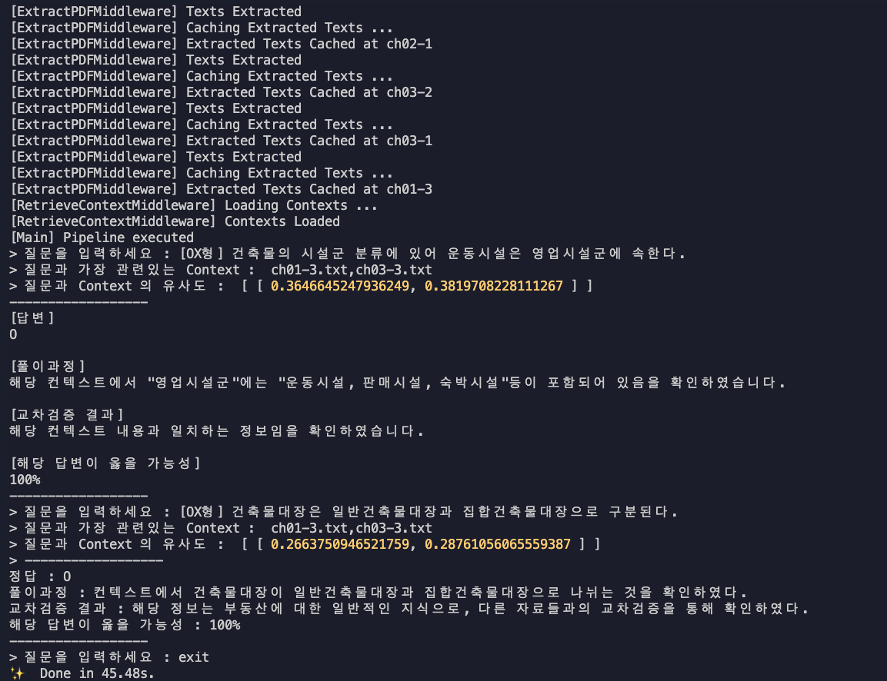
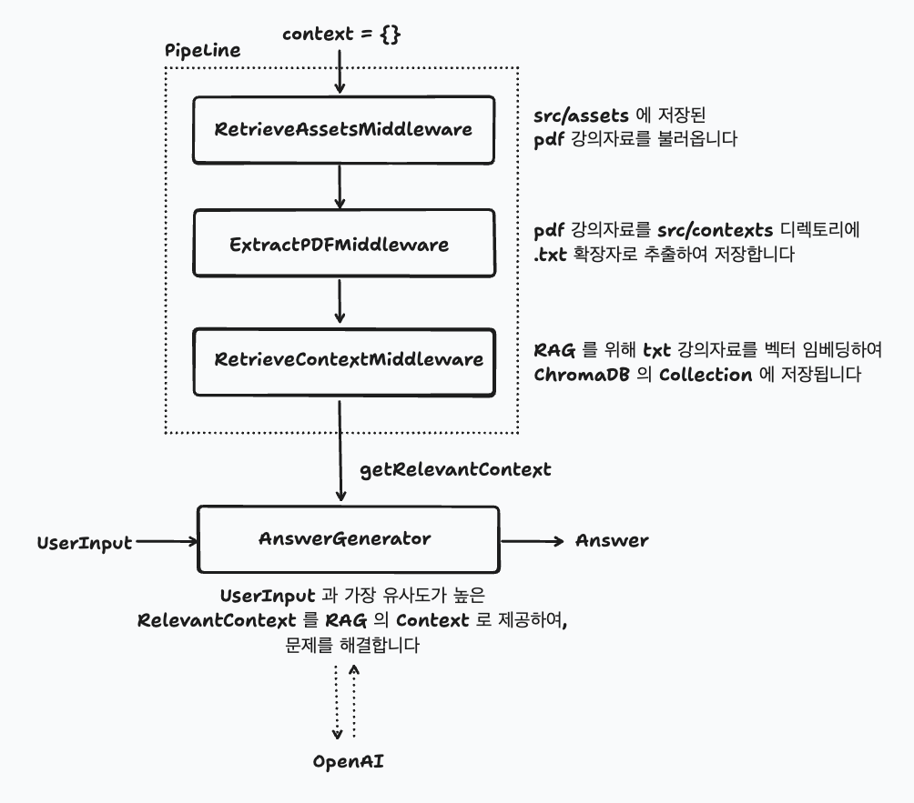

## 기말고사 문제풀이 봇

### ⚠️ 반드시 읽어주세요!

> ❗️ 답변은 AI가 제공하므로, 정답에 대한 책임은 사용자에게 있습니다 <br/> ❗️ OpenAI API 사용에 따른 비용은 사용자 본인이 부담합니다. <br/>❗️ LLM 이 답변을 생성하는데에 시간이 소요될 수 있습니다.

### 🎥 데모



### ⚙️ 요구사항

> **Docker가 설치되어 있어야 합니다. <br/> Node.js(v18+) 가 설치되어 있어야 합니다.**

### 🛫 Getting Started

#### 1️⃣ 강의자료 첨부

`.pdf` 확장자로된 강의자료를 `src/assets` 디렉토리에 넣어주세요. <br/>
강의 자료 크기가 큰 경우, pdf 를 분할하여 넣어주세요. <br/>
(최대 토큰 사이즈가 넘어가는경우, 제대로 동작하지 않을 수 있습니다)

#### 2️⃣ yarn 패키지 매니저 설치 (권장)

```bash
npm install -g yarn
```

#### 3️⃣ 환경변수 설정

본 모델은 OpenAI 의 GPT 4o 모델을 사용합니다. <br/>
사용전, **Open AI API Key 를 발급받아** 다음과 같이 `.env` 파일에 넣어주세요

```bash
# 사용할 Open AI 모델
OPEN_AI_MODEL=gpt-4
# Open AI 에서 발급받은 API Key
OPEN_AI_API_KEY=your-open-ai-api-key
# ChromaDB URL (클론받은 docker-compose.yml을 실행할 경우 http://localhost:8000)
CHROMA_DB_PATH=http://localhost:8000
# ChromaDB Collection Name (테이블 명이라고 생각하시면 됩니다)
CHROMA_DB_COLLECTION_NAME=your-collection-name
```

#### 4️⃣ docker-compose.yml 실행

Docker Compose를 실행해 ChromaDB 를 실행합니다.

```bash
sudo docker-compose up
```

#### 5️⃣ 실행

모든 준비가 완료되었습니다. 아래 명령어를 입력해 애플리케이션을 실행해주세요.

```
yarn start
```

### ❗️ 참고사항

해당 문제를 실제로 푸는 프롬프트는 `src/modules/AnswerGenerator.js` 에 있습니다. <br/>
직접 커스텀 하셔도 상관 없습니다.

### 🗂️ 프로젝트 구조


